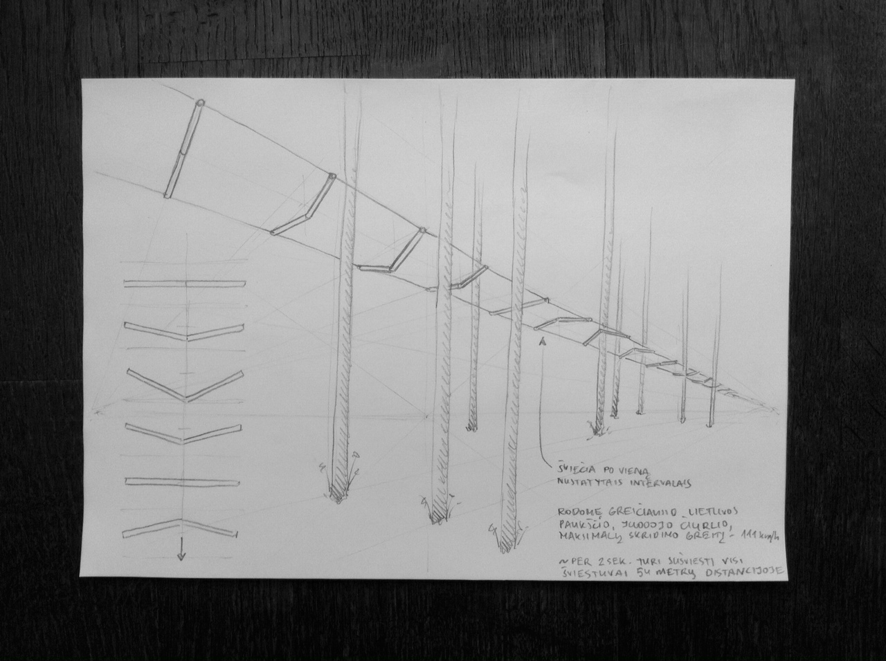
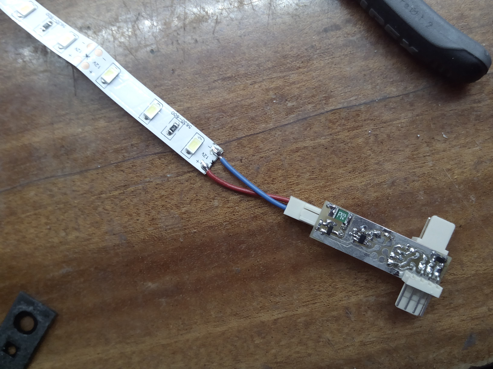

# Čiurlys (Apus Apus)

Electronics to support the light art installation Apus Apus by Justė Brukštutė / Jonas Liugaila / Rūta Ivaškevičiūtė / Albertas Mickėnas.

The installation consists of several acrylic tubes that are shaped to different frames of an animation 
depicting a flight of a bird.



Acrylic tubes have a LED strip and controll electronics installed in them. Each tube has a small microcontroller that 
implements a simple protocol that allows to daisy-chain the segmens.



The main callenges were to fight the inductivity of the cable and dampen the ringing on power lines - zeners were enough 
to avoid dangerously high and negative spikes. The output transistor has enough of umph to survive a dead short while 
polyfuse catches up. Input protection transils were not implemented to keep the cost low, I got to rely on potection diodes
inside the attiny.


For now the firmware is waiting for pulse on the input pin then outputs pulses of the same length on the output pin. A
digital one-wire protocol similar to the one used in ws2812 or proprietary Maxim 1-Wire® protocol is envisioned for the future.

```c
	while(1) {
		while(isInputHigh()) {
			//wait
		}

		startInputPulseTimer();
		while(isInputLow() && !inputTimeout) {
			if(isNotaGlitch()) {
				on(LED);
			}
			//wait
		}
		stopInputPulseTimer();
		off(LED);

		if(inputTimeout) {
			while(isInputLow()) {
				//wait
			}
		} else {
			if(isNotaGlitch()) {
				off(OUTPUT);
				startOutputPulseTimer();
				while(!outputPulseDone) {
					//wait
				}
				stopOutputPulseTimer();
				on(OUTPUT);
			}
		}
	}
```

A video of the installation being set up:

[](http://www.youtube.com/watch?v=SOXjC1DidxA?rel=0)

A vide of the installation running at night:

[](http://www.youtube.com/watch?v=rREeh75hglU?rel=0)
